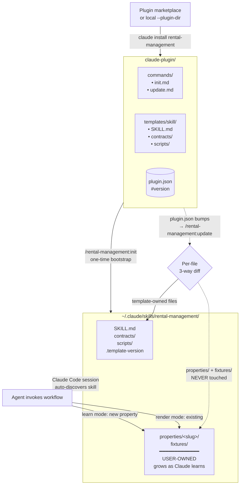

# rental-management

*Česká verze: [`README_CZ.md`](./README_CZ.md)*

**AI-agent-first rental management platform.** Minimal UI, rich MCP + Skills. Agents do the work — what used to take a day takes minutes.

## Philosophy

Annual property reconciliation traditionally takes hours, sometimes a whole day per property: pull invoices from email, find the right `evidenční list`, reconcile electricity bills against monthly advances, compute solar credits and FO odečet, draft an amendment for the new rent, send a summary to the tenant. Repetitive, error-prone, manual.

This project is built on a simple premise: **in a world of capable AI agents, no one wants to click through a UI to fill values into a proprietary form**. So we don't ask them to. The web app is intentionally minimal — it holds only the business logic and the data structure, plus a thin UI for review and correction. The real value lives elsewhere:

- A **clean REST API + MCP server** (and a CLI planned) that exposes every entity (properties, contracts, payments, cost statements, reconciliations, tenants, …) with strong types and idempotent writes — designed for agents first, humans second.
- A **Claude Code plugin** with skills that teach an agent *how* to perform the annual reconciliation: read whatever source documents the user happens to have (PDF, DOCX, image, CSV, bank export, email body) → parse → compute domain-specific adjustments → write the result to the platform → produce a polished PDF for the tenant.
- A **per-property learning loop**: the first time the agent processes documents for a property, it writes its own parsers and computers and saves regression fixtures. Subsequent runs reuse them. The skill compounds in value with every use.

What the user does: point the agent at their source documents — bank statement, SVJ evidenční list, contract, electricity bill — and confirm the result before it persists. Done in minutes instead of hours.

### Where this leads

That the MCP server (CLI TBD) is just an agentic interface and it works with any client that speaks the protocol (Claude Code, Claude Desktop, Cursor, …). The Claude Code plugin is one workflow on top, not the only one possible. Combined with other MCPs (email, file, bank export parser) and Skills, you can get to worklfows like:

- An always-on agent that watches a landlord inbox, registers incoming `evidenční list` PDFs as cost statements, flags late payments. No custom app — just wired-together MCP servers and a system prompt.
- Monthly bank export → matched against contracts → late-payment surfaces in the UI.
- Rent change → amendment rendered to PDF from the new terms and a prior amendment template.
- Year-end → reconciliation PDF generated and emailed.

The domain logic and the MCP surface stay the same regardless of which agent runs on top.

---

## Features

Built from real-life messiness of a Czech residential lease — not a textbook generalization.

### Contracts evolve over time

A lease isn't a single snapshot. Rent goes up, payment day changes, service advance gets adjusted, a utility is added or removed. The model is SCD2 — every change to `contract_terms`, `contract_utility`, or `property_service_tariff` opens a new row with a `validFrom`, closing the prior one. Past reconciliations still see their original terms; new reconciliations see the latest. Amendments are first-class data, not free-text notes.

### Each cost kind can have its own billing cycle

Annual services reconciliation runs on the calendar year. Electricity from PRE comes on a Feb 15 – Feb 14 cycle. Water comes monthly. Gas comes quarterly. The reconciliation derives a separate `matchPeriod` per kind from whatever statements cover the recon period, and the slot iteration spans the union — so a Jan–Dec reconciliation correctly counts an electricity advance paid in Feb of the following year, against a Feb–Feb statement.

When two annual cycles touch at a boundary month (e.g., a Feb 15 – Feb 14 statement followed by another Feb 15 – Feb 14 next year), the second statement's `matchPeriod` auto-shifts forward by one month to prevent double-counting that February across two reconciliations.

### Coverage validation

If two consecutive statements of the same kind have a gap (e.g., one covers Jan–Mar, the next picks up in May), the reconciliation surfaces a warning showing exactly which days are not covered by any statement. Payments in that gap won't reconcile against anything — either you're missing a statement or it's intentional and the warning is dismissable context.

### Rent reductions (srážky)

The tenant occasionally pays for something that should have been the owner's (e.g., a one-off repair, a fix the tenant covered upfront). They agree to subtract that amount from a specific month's rent. The platform models this as a `rent_reduction` row tied to that month — the rent expectation for that one month becomes `max(0, baseRent − reduction)`, and the allocation respects that lowered floor without contaminating other months or pretending the tenant paid less than they did.

### Cost statement adjustments

Each cost statement carries a signed `adjustmentAmount` with a human-readable note. Use case: the owner has a solar installation they're still paying off, so they take a credit per kWh consumed (the tenant's electricity advances against actual cost minus solar credit). The adjustment lands in the audit trail next to the original `totalAmount` so the tenant can see exactly why their bill differs from the raw invoice.

### Evidenční list with deductible (FO odečet)

The SVJ `evidenční list` lists a total monthly advance and inside it a "deductible" portion that belongs to the owner (typical case: FO odečet — depreciation-like amount the owner offsets against income tax). The tenant's actual service obligation is `totalSvjAdvance − deductibleAmount`. Tariff history is temporal — when SVJ raises the advance mid-year, both halves can change independently.

### Source document linking

Cost statements, tariffs, and contract amendments each carry an optional `documentRef` — a URL or file path. The UI renders URLs as clickable links (hostname extracted) so you can jump from a number in the reconciliation breakdown directly to the source PDF in Drive, Dropbox, or wherever the document lives. Agents writing data via MCP store the document path automatically.

### Payment timing on the contract, not the platform

Some leases say "rent due on the 5th of the current month", others say "rent for July paid by 25 June" (paid in advance). Both are common. Each contract carries its own `paymentDueDay` + `paymentAppliesTo` (`current` or `next`) on the temporal terms, so the reconciliation knows when a payment is late and which month it naturally belongs to. Amendments can change this mid-contract; payments paid under the old rule keep the old offset for their natural-month assignment.

### Reconciliation is recomputed on every view

The persisted reconciliation row stores only the final numbers per kind. The breakdown (months, payments, allocations, cost statements) is rebuilt on every GET from current data. If something changes underneath — a new payment, an updated cost statement, a rent reduction added late — the UI flags the persisted total as stale next to the freshly-computed one. No silent drift between what's stored and what the data now implies.

---

## Monorepo

| Component | Where it runs | Purpose |
|---|---|---|
| **Web app** (frontend + REST API) | Vercel | Source of truth — owns DB, auth, REST endpoints. UI is for review and edge-case correction, not bulk data entry. |
| **MCP server** | Locally at the user (stdio) | Thin client wrapping the REST API — exposes one tool per resource so any LLM client (Claude Code, Cursor, etc.) can read and write data. |
| **Claude Code plugin** | User-installable | Packaged workflow that teaches the agent the annual reconciliation process. Self-extends with per-property knowledge. |

---

## Tech stack

**Backend:** TypeScript · Hono · Drizzle ORM (postgres-js) · better-auth · Zod · PostgreSQL (local Docker / Neon prod)
**Frontend:** React 19 · Vite · TailwindCSS · shadcn/ui · TanStack Query
**Testing:** Vitest · Playwright
**MCP:** fastmcp (stdio)
**Documents (in plugin):** Typst (Latex-modern alternative) · pandoc · reportlab (Python, PDF)

---

## Quick start

```bash
# 1. Local Postgres
docker run -d --name rental-pg -e POSTGRES_PASSWORD=postgres -p 5432:5432 postgres:16
docker exec rental-pg createdb -U postgres rental_dev

# 2. Install + env + migrate
pnpm install
cp .env.example .env   # adjust DATABASE_URL if needed
pnpm db:migrate

# 3. Run dev
pnpm dev               # API on :3000, Vite on :5173
```

Deployment to Vercel + Neon: see [`DEPLOY.md`](./DEPLOY.md).
Repo orientation for contributors / AI agents: see [`CLAUDE.md`](./CLAUDE.md).

---

## Architecture

### High level

```
                    ┌──────────────────────────┐
                    │   User (browser / CLI)   │
                    └────┬──────────────┬──────┘
                         │              │
                  browser│              │stdio
                         │              │
                    ┌────▼──────┐  ┌────▼─────────┐
                    │  Vite SPA │  │  MCP server  │
                    │  (React)  │  │  (fastmcp)   │
                    └────┬──────┘  └────┬─────────┘
                         │              │
                         │ /api         │ HTTPS + token
                         │              │
                    ┌────▼──────────────▼─────────┐
                    │  Hono REST API (Vercel fn)  │
                    │  • auth (better-auth)       │
                    │  • routes → core/services/  │
                    └────┬────────────────────────┘
                         │
                    ┌────▼────────┐
                    │  PostgreSQL │
                    │  (Neon)     │
                    └─────────────┘
```

### Code structure

```
api/                  → Vercel serverless entry (Hono adapter, production)
server/               → Local Node.js entry (long-running, dev only)
  app.ts              → buildApp(deps) — composes routes + middleware
  routes/             → REST endpoints (one file per resource)
  middleware/         → Auth context (session + API token)
core/                 → Pure domain logic, framework-free
  db/                 → Drizzle schema, client, migration runner
  services/           → Business logic per resource
  lib/                → Pure helpers (allocation, payment-matching, temporal)
  auth/               → better-auth setup
src/                  → React frontend (Vite)
mcp/                  → Standalone MCP server (separate concern)
  tools/              → One file per resource exposing MCP tools
tests/                → Vitest integration + service tests (fresh-DB per test)
tests-e2e/            → Playwright browser tests
drizzle/              → Generated SQL migrations
claude-plugin/        → Claude Code plugin (workflow skill)
```

`core/` is the heart — every route handler and MCP tool is a thin shell calling into `core/services/*.ts`. The same business logic backs HTTP and MCP. UI (`src/`) talks only to `/api`.

### Domain rules (summarized)

- **Money in haléře** (integer CZK × 100), never float.
- **Multi-tenant via `orgId`** on every row; services enforce filtering.
- **SCD2 temporal pattern** for terms / utilities / tariffs (`validFrom`, `validTo`).
- **Rent-first allocation** for payments (rent → services → utilities).
- **FIFO payment matching with `naturalMonth`** — one payment never splits across months.
- **Per-kind `matchPeriod`** for reconciliation, with **auto-shift** to prevent double-counting boundary months across years.

Detailed explanations in [`CLAUDE.md`](./CLAUDE.md) and `core/services/reconciliation.ts`.

---

## Claude Code plugin: skill architecture

The plugin's most distinctive design choice: **the user owns the workflow skill**. The plugin ships a *template* that the user copies into their local skill directory once. The local copy then grows over time as Claude Code learns each property's documents and parsing rules — without that knowledge ever flowing back to the plugin.



### What the two flows do

**`/rental-management:init`** (run once after installing the plugin):
1. Asks the user where to install (default `~/.claude/skills/rental-management/`).
2. Copies the plugin's `templates/skill/` tree to that location.
3. Optionally helps set up `.mcp.json` so Claude Code can find the MCP server.
4. Writes `.template-version` marker (tracks which plugin version was synced).

**`/rental-management:update`** (run after the plugin updates):
1. Compares `.template-version` in the local skill with current plugin version.
2. If newer: per-file diff for template-owned files (`SKILL.md`, `scripts/*`, `contracts/*`).
3. User chooses per file: **overwrite** / **manual merge** (`*.template-new` written alongside) / **skip**.
4. **`properties/` and `fixtures/` are explicitly never touched** — user-owned data.
5. Bumps `.template-version` marker.

### How the skill "self-updates as it learns"

The plugin template seeds the skeleton. The local skill then accumulates per-property knowledge inside `properties/<slug>/`:

```
~/.claude/skills/rental-management/
├── SKILL.md                       ← from template (updated via /update)
├── contracts/                     ← from template
├── scripts/                       ← from template
├── .template-version              ← sync marker
└── properties/                    ← USER-OWNED (never overwritten)
    ├── <property-a>/
    │   ├── README.md              ← per-property methodology
    │   ├── electricity_parser.py  ← if PDF parsing needed
    │   ├── compute_solar.py       ← if domain math needed
    │   └── fixtures/              ← regression test data
    └── <property-b>/
        └── ...
```

The first time the user processes documents for a new property, Claude enters **learning mode**: it asks about document structure, writes parsers/computers as Python scripts, and saves regression fixtures. Subsequent reconciliations for the same property reuse those parsers automatically.

This separation means:
- Plugin updates (new SKILL.md sections, new shared scripts) can flow safely.
- Per-property data (which is personal and sometimes sensitive) stays out of the plugin and out of git history.
- A user can fork the local skill freely without losing template-updateability.

### Sub-skills

- **Root skill** (`SKILL.md`) — annual rental reconciliation workflow (read documents → parse → compute → reconcile via MCP → produce PDF for tenant).
- **`contracts/SKILL.md`** — Typst-based contract and amendment document generation. Two modes: *learn template* from existing DOCX/PDF, *render document* from saved template + MCP data.

---

## MCP server (separate package — eventually)

`mcp/` runs as a stdio process at the user's machine. It exposes one tool per REST resource (`properties_list`, `contracts_get`, `payments_record_batch`, …) and authenticates against the hosted API via a per-user token.

```jsonc
// ~/.claude/mcp.json
{
  "mcpServers": {
    "rental-management": {
      "command": "pnpm", "args": ["mcp"],
      "cwd": "/path/to/rental-management",
      "env": {
        "RENTAL_API_URL": "https://your-app.vercel.app",
        "RENTAL_API_TOKEN": "<from /settings/api-tokens>"
      }
    }
  }
}
```

Eventually this will be published as an npm package consumable via `npx`, removing the need for users to clone the repo locally.

---

## Documentation

- [`CLAUDE.md`](./CLAUDE.md) — orientation for AI agents and contributors
- [`DEPLOY.md`](./DEPLOY.md) — Vercel + Neon deployment checklist
- [`claude-plugin/CHANGELOG.md`](./claude-plugin/CHANGELOG.md) — plugin release notes
- [`claude-plugin/templates/skill/SKILL.md`](./claude-plugin/templates/skill/SKILL.md) — end-user workflow skill
- [`claude-plugin/templates/skill/contracts/SKILL.md`](./claude-plugin/templates/skill/contracts/SKILL.md) — contracts sub-skill

---

## License

Private / personal use.
