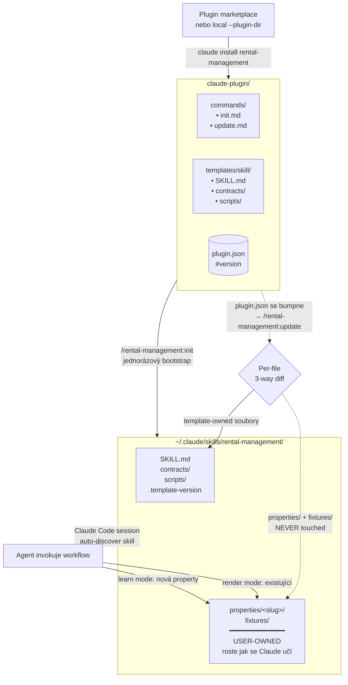

# AI-first správa nájemních nemovitostí

*English version: [`README.md`](./README.md)*

**Platforma pro správu nájmů, navržená primárně pro AI agenty.** Minimální UI, bohaté MCP + Skills. Agenti odvedou práci — to, co dříve zabralo den, trvá teď minuty.

## Filozofie

Roční vyúčtování pronájmu tradičně zabere hodiny, někdy klidně celý den na jednu nemovitost: dohledat faktury v mailu, najít aktuální evidenční list, srovnat faktury za elektřinu proti měsíčním zálohám, spočítat solar credit a FO odečet, sepsat dodatek pro nové nájemné, poslat shrnutí nájemníkovi. Repetitivní, náchylné k chybám, ruční.

Tenhle projekt staví na jednoduchém předpokladu: **ve světě schopných AI agentů nikdo nechce proklikávat UI a vyplňovat hodnoty do nějakého proprietárního formuláře.** Tak po něm to nechceme. Webová aplikace je záměrně minimální — drží jen business logiku a datovou strukturu, plus tenké UI na review a opravy. Skutečná hodnota leží jinde:

- **Čisté REST API + MCP server** (a plánované CLI), které vystavují každou entitu (nemovitosti, smlouvy, platby, vyúčtování nákladů, reconciliations, nájemníky, …) se silně typovanými, idempotentními zápisy — design primárně pro agenty, sekundárně pro lidi.
- **Claude Code plugin** se skilly, které naučí agenta *jak* roční vyúčtování provést: přečíst zdrojové dokumenty v jakékoliv formě, kterou user zrovna má (PDF, DOCX, obrázek, CSV, bankovní export, tělo emailu) → parsovat → spočítat doménově specifické úpravy → zapsat výsledek do platformy → vyrobit hezké PDF pro nájemníka.
- **Per-property learning loop**: poprvé když agent zpracuje dokumenty z nové nemovitosti, napíše si vlastní parsery a kalkulátory a uloží regression fixtury. Příště je znovu použije. Hodnota skillu narůstá s každým použitím.

Co dělá uživatel: ukáže agentovi zdrojové dokumenty — bankovní výpis, SVJ evidenční list, smlouvu, fakturu za elektřinu — a před zápisem výsledek potvrdí. Hotovo za minuty místo hodin.

### Kam to směřuje

To, že MCP server (CLI TBD) je pouhé agentické rozhraní, znamená, že funguje s jakýmkoliv klientem, který mluví protokolem (Claude Code, Claude Desktop, Cursor, …). Claude Code plugin je jeden workflow nahoře, ne jediný možný. V kombinaci s dalšími MCP servery (email, file, parser bankovních exportů) a Skilly se dostaneš ke scénářům jako:

- Always-on agent, který sleduje schránku majitele, registruje příchozí PDF evidenčních listů jako cost statementy a označuje pozdní platby. Žádná custom aplikace — jen propojené MCP servery a system prompt.
- Měsíční bankovní export → přiřazený proti smlouvám → pozdní platby vyskočí v UI.
- Změna nájemného → dodatek vyrendrovaný do PDF z nových podmínek a šablony předchozího dodatku.
- Konec roku → reconciliation PDF vygenerované a odeslané.

Doménová logika a MCP rozhraní zůstávají stejné, ať nahoře běží jakýkoliv agent.

---

## Funkce

Postavené na reálné zašmodrchanosti českého rezidenčního nájmu — ne na učebnicovém zobecnění.

### Smlouvy se vyvíjejí v čase

Nájemní smlouva není jeden snapshot. Roste nájemné, mění se den splatnosti, upravuje se záloha na služby, přidává/odebírá se médium. Model je SCD2 — každá změna v `contract_terms`, `contract_utility` nebo `property_service_tariff` otevírá nový řádek s `validFrom` a uzavírá ten předchozí. Minulé reconciliace pořád vidí původní podmínky; nové vidí aktuální. Dodatky jsou first-class data, ne textové poznámky.

### Každý druh nákladu může mít vlastní zúčtovací cyklus

Roční vyúčtování služeb běží na kalendářní rok. Elektřina od PRE chodí na cyklus 15. února – 14. února. Voda chodí měsíčně. Plyn kvartálně. Reconciliace odvozuje samostatný `matchPeriod` per kind z toho, jaké statementy pokrývají reconciliation periodu, a iterace přes měsíce pokrývá jejich union — takže reconciliace Jan–Dec správně započte zálohu za elektřinu zaplacenou v únoru následujícího roku proti statementu Feb–Feb.

Když se dva roční cykly potkají na hraničním měsíci (např. statement 15. 2. – 14. 2. následovaný dalším 15. 2. – 14. 2. na další rok), `matchPeriod` druhého statementu se automaticky posune o měsíc dopředu, aby ten únor nebyl započítán dvakrát napříč reconciliations.

### Validace pokrytí

Pokud mají dva po sobě jdoucí statementy stejného druhu mezeru (jeden pokrývá Jan–Mar, další navazuje až v Květnu), reconciliace zobrazí varování s přesným seznamem dnů, které nejsou pokryté žádným statementem. Platby v té mezeře se nepřiřadí proti ničemu — buď ti chybí statement, nebo je to záměr a varování je jen kontextová informace.

### Srážky z nájmu

Občas nájemník zaplatí něco, co mělo jít za majitelem (např. jednorázová oprava, kterou nájemník zaplatil ze svého). Dohodnou se, že se ta částka srazí z konkrétního měsíčního nájmu. Platforma to modeluje jako `rent_reduction` řádek navázaný na ten měsíc — očekávaný nájem pro daný měsíc se stane `max(0, baseRent − srážka)`, a alokace platby respektuje tu sníženou hranici, aniž by kontaminovala ostatní měsíce nebo předstírala, že nájemník zaplatil méně než ve skutečnosti.

### Úpravy cost statementu

Každý cost statement nese podepsaný `adjustmentAmount` s textovou poznámkou. Use case: majitel má fotovoltaiku, kterou ještě splácí, takže si bere kredit za kWh spotřebované nájemníkem (zálohy na elektřinu se srovnávají proti reálnému nákladu mínus solar credit). Úprava sedí v audit trailu vedle původního `totalAmount`, takže nájemník přesně vidí, proč se jeho účet liší od holé faktury.

### Evidenční list s odečtem (FO odečet)

SVJ evidenční list uvádí celkovou měsíční zálohu a v ní část, která patří majiteli ("deductible" — typický případ: FO odečet, částka podobná odpisům, kterou si majitel uplatňuje proti dani z příjmu). Skutečný závazek nájemníka na služby je `totalSvjAdvance − deductibleAmount`. Historie tarifu je temporální — když SVJ zvedne zálohu uprostřed roku, obě složky se můžou změnit nezávisle.

### Odkazy na zdrojové dokumenty

Cost statementy, tarify a dodatky smluv můžou nést volitelný `documentRef` — URL nebo cesta k souboru. UI URL rendruje jako klikatelný odkaz (vytáhne hostname), takže z čísla v breakdownu reconciliace skočíš rovnou na zdrojové PDF v Drive, Dropboxu nebo kde dokument bydlí. Agenti zapisující data přes MCP cestu k dokumentu ukládají automaticky.

### Platební podmínky na smlouvě, ne na platformě

Některé nájemní smlouvy říkají "nájemné splatné do 5. dne aktuálního měsíce", jiné "nájemné za červenec se platí do 25. června" (předem). Obojí je běžné. Každá smlouva nese vlastní `paymentDueDay` + `paymentAppliesTo` (`current`/`next`) v temporálních termech, takže reconciliace ví, kdy je platba pozdě a do jakého měsíce přirozeně patří. Dodatky to můžou změnit i v průběhu smlouvy; platby provedené pod starým pravidlem si pro svůj naturalMonth zachovají starý offset.

### Reconciliace se přepočítává při každém zobrazení

Persistovaný reconciliation řádek ukládá jen finální čísla per kind. Breakdown (měsíce, platby, alokace, cost statementy) se na každém GETu znovu staví ze současných dat. Pokud se něco pod tím změní — nová platba, upravený cost statement, dodatečně přidaná srážka — UI označí persistovaný total jako stale vedle čerstvě spočítaného. Žádný tichý drift mezi tím, co je uložené, a tím, co data teď znamenají.

---

## Monorepo

| Komponenta | Kde běží | Účel |
|---|---|---|
| **Webová aplikace** (frontend + REST API) | Vercel | Source of truth — vlastní DB, auth, REST endpointy. UI je na review a opravy edge case'ů, ne na bulk zadávání dat. |
| **MCP server** | Lokálně u uživatele (stdio) | Tenký klient nad REST API — vystavuje jeden tool per resource, takže jakýkoliv LLM klient (Claude Code, Cursor, atd.) může číst i zapisovat. |
| **Claude Code plugin** | Instalovatelný uživatelem | Hotový workflow, který naučí agenta proces ročního vyúčtování. Sám se rozšiřuje per-property znalostmi. |

---

## Tech stack

**Backend:** TypeScript · Hono · Drizzle ORM (postgres-js) · better-auth · Zod · PostgreSQL (lokální Docker / Neon prod)
**Frontend:** React 19 · Vite · TailwindCSS · shadcn/ui · TanStack Query
**Testing:** Vitest · Playwright
**MCP:** fastmcp (stdio)
**Dokumenty (v pluginu):** Typst (moderní alternativa k LaTeXu) · pandoc · reportlab (Python, PDF)

---

## Quick start

```bash
# 1. Lokální Postgres
docker run -d --name rental-pg -e POSTGRES_PASSWORD=postgres -p 5432:5432 postgres:16
docker exec rental-pg createdb -U postgres rental_dev

# 2. Install + env + migrace
pnpm install
cp .env.example .env   # pokud potřeba, uprav DATABASE_URL
pnpm db:migrate

# 3. Dev server
pnpm dev               # API na :3000, Vite na :5173
```

Deploy na Vercel + Neon: viz [`DEPLOY.md`](./DEPLOY.md).
Orientace v repu pro contributory / AI agenty: viz [`CLAUDE.md`](./CLAUDE.md).

---

## Architektura

### High level

```
                    ┌──────────────────────────┐
                    │   Uživatel (browser/CLI) │
                    └────┬──────────────┬──────┘
                         │              │
                  browser│              │stdio
                         │              │
                    ┌────▼──────┐  ┌────▼─────────┐
                    │  Vite SPA │  │  MCP server  │
                    │  (React)  │  │  (fastmcp)   │
                    └────┬──────┘  └────┬─────────┘
                         │              │
                         │ /api         │ HTTPS + token
                         │              │
                    ┌────▼──────────────▼─────────┐
                    │  Hono REST API (Vercel fn)  │
                    │  • auth (better-auth)       │
                    │  • routes → core/services/  │
                    └────┬────────────────────────┘
                         │
                    ┌────▼────────┐
                    │  PostgreSQL │
                    │  (Neon)     │
                    └─────────────┘
```

### Struktura kódu

```
api/                  → Vercel serverless entry (Hono adapter, produkce)
server/               → Lokální Node.js entry (long-running, jen dev)
  app.ts              → buildApp(deps) — skládá routes + middleware
  routes/             → REST endpointy (jeden soubor per resource)
  middleware/         → Auth context (session + API token)
core/                 → Čistá doménová logika, framework-free
  db/                 → Drizzle schema, klient, migration runner
  services/           → Business logika per resource
  lib/                → Pure helpers (allocation, payment-matching, temporal)
  auth/               → better-auth setup
src/                  → React frontend (Vite)
mcp/                  → Standalone MCP server (samostatná concern)
  tools/              → Jeden soubor per resource vystavující MCP tooly
tests/                → Vitest integration + service testy (fresh DB per test)
tests-e2e/            → Playwright browser testy
drizzle/              → Generované SQL migrace
claude-plugin/        → Claude Code plugin (workflow skill)
```

`core/` je srdce — každý route handler a MCP tool je tenká slupka volající `core/services/*.ts`. Stejná business logika pohání HTTP i MCP. UI (`src/`) mluví jen s `/api`.

### Doménová pravidla (zkrácený přehled)

- **Peníze v haléřích** (integer CZK × 100), nikdy float.
- **Multi-tenant přes `orgId`** na každém řádku; services filtrování vynucují.
- **SCD2 temporal pattern** pro terms / utilities / tarify (`validFrom`, `validTo`).
- **Rent-first alokace** plateb (nájem → služby → utility).
- **FIFO matching plateb přes `naturalMonth`** — jedna platba se nikdy nedělí napříč měsíci.
- **`matchPeriod` per kind** v reconciliaci, s **auto-shift** proti double-countu hraničních měsíců napříč roky.

Detailní vysvětlení v [`CLAUDE.md`](./CLAUDE.md) a `core/services/reconciliation.ts`.

---

## Claude Code plugin: architektura skillu

Nejvýraznější designové rozhodnutí pluginu: **workflow skill vlastní uživatel**. Plugin posílá *šablonu*, kterou si user jednorázově zkopíruje do svého lokálního skill adresáře. Lokální kopie pak roste, jak Claude Code učí dokumenty a parsovací pravidla konkrétní nemovitosti — aniž by ta znalost kdy putovala zpátky do pluginu.



### Co dva flows dělají

**`/rental-management:init`** (spustit jednou po instalaci pluginu):
1. Zeptá se, kam nainstalovat (default `~/.claude/skills/rental-management/`).
2. Zkopíruje plugin `templates/skill/` strom na to místo.
3. Volitelně pomůže nastavit `.mcp.json`, ať Claude Code najde MCP server.
4. Zapíše `.template-version` marker (sleduje verzi pluginu, se kterou bylo synchronizováno).

**`/rental-management:update`** (spustit po update pluginu):
1. Porovná `.template-version` v lokálním skillu s aktuální verzí pluginu.
2. Pokud novější: per-file diff pro template-owned soubory (`SKILL.md`, `scripts/*`, `contracts/*`).
3. User vybírá per soubor: **overwrite** / **manual merge** (`*.template-new` napsaný vedle) / **skip**.
4. **`properties/` a `fixtures/` se explicitně nikdy nedotknou** — user-owned data.
5. Bumpne `.template-version` marker.

### Jak se skill "samoupdatuje, jak se učí"

Plugin template nasází kostru. Lokální skill pak akumuluje per-property znalost uvnitř `properties/<slug>/`:

```
~/.claude/skills/rental-management/
├── SKILL.md                       ← ze šablony (update přes /update)
├── contracts/                     ← ze šablony
├── scripts/                       ← ze šablony
├── .template-version              ← sync marker
└── properties/                    ← USER-OWNED (nikdy nepřepsané)
    ├── <property-a>/
    │   ├── README.md              ← per-property metodika
    │   ├── electricity_parser.py  ← pokud potřeba parsovat PDF
    │   ├── compute_solar.py       ← pokud potřeba doménová matematika
    │   └── fixtures/              ← regression test data
    └── <property-b>/
        └── ...
```

Při prvním zpracování dokumentů pro novou nemovitost Claude vstoupí do **learning mode**: ptá se na strukturu dokumentu, píše parsery/kalkulátory jako Python skripty a ukládá regression fixtury. Další reconciliace pro tu samou nemovitost ty parsery použijí automaticky.

Tahle separace znamená:
- Plugin updaty (nové sekce v SKILL.md, nové sdílené skripty) můžou bezpečně téct dolů.
- Per-property data (osobní a někdy citlivá) zůstávají mimo plugin i mimo git history.
- User si může lokální skill libovolně forkovat bez ztráty schopnosti dostávat template updaty.

### Sub-skilly

- **Root skill** (`SKILL.md`) — workflow ročního vyúčtování (read documents → parse → compute → reconcile přes MCP → vyrobit PDF pro nájemníka).
- **`contracts/SKILL.md`** — Typst-based generování smluv a dodatků. Dva módy: *learn template* z existujícího DOCX/PDF, *render document* z uložené šablony + dat z MCP.

---

## MCP server (časem samostatný balíček)

`mcp/` běží jako stdio proces na stroji uživatele. Vystavuje jeden tool per REST resource (`properties_list`, `contracts_get`, `payments_record_batch`, …) a autentizuje se proti hostovanému API přes per-user token.

```jsonc
// ~/.claude/mcp.json
{
  "mcpServers": {
    "rental-management": {
      "command": "pnpm", "args": ["mcp"],
      "cwd": "/path/to/rental-management",
      "env": {
        "RENTAL_API_URL": "https://your-app.vercel.app",
        "RENTAL_API_TOKEN": "<from /settings/api-tokens>"
      }
    }
  }
}
```

Časem to bude publikované jako npm balíček konzumovatelný přes `npx`, takže user nebude muset mít naklonovaný repo lokálně.

---

## Dokumentace

- [`CLAUDE.md`](./CLAUDE.md) — orientace pro AI agenty a contributory
- [`DEPLOY.md`](./DEPLOY.md) — Vercel + Neon deployment checklist
- [`claude-plugin/CHANGELOG.md`](./claude-plugin/CHANGELOG.md) — release notes pluginu
- [`claude-plugin/templates/skill/SKILL.md`](./claude-plugin/templates/skill/SKILL.md) — end-user workflow skill
- [`claude-plugin/templates/skill/contracts/SKILL.md`](./claude-plugin/templates/skill/contracts/SKILL.md) — contracts sub-skill

---

## License

Private / personal use.
